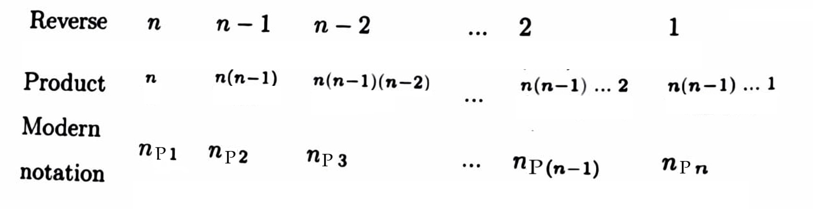

# Arithmetic

# *1. Addition*

## Description

The `add` function takes any number of integer arguments (`*args`), representing the numbers to be added column-wise. These integers can be positive, negative, or zero. The function adds these numbers column-wise as if they were aligned on the right side (like in addition) and returns the sum.

## Inputs
The function `add` takes any number of integer arguments. These arguments represent the numbers to be added column-wise.

## Outputs

The function returns an integer, which represents the sum of the numbers added column-wise.

## Algorithm

1. Find the maximum length of the input numbers by iterating through each number in `args` and finding the length of the string representation of each number.
2. Create a list of lists called `sum_columns`, where each inner list represents a column and contains the digits of the numbers at that column position, reversed. If a number is shorter than the maximum length, pad the digits with zeros.
3. Calculate the sum of each column by summing up the digits at each position in `sum_columns`.
4. Compute the final result by iterating through the sums of each column, multiplying each sum by 10 raised to the power of its column position, and adding them together.
5. Return the final result.

## Process


## Complexity

- **Time Complexity**: O(n), where n is the total number of digits across all input numbers.
- **Space Complexity**: O(n), where n is the total number of digits across all input numbers.

## Example Usage

```python
result = add(1234, 2341, 1234, 134, 3251, 531465, 1346)
print(result)  # Output: 963, 852, 741
```

# 2. *Subtraction*

## Description

The `subtract` function takes two integers `a` and `b` and performs subtraction. It returns an integer representing the result of the subtraction.

## Inputs

The function `subtract` takes two integer arguments, `a` and `b`, which are the numbers to be subtracted.

## Outputs

The function returns an integer representing the result of the subtraction.

## Algorithm

1. Convert the input numbers `a` and `b` into lists of digits.
2. Ensure that `num1` (representing the larger number) is at least as long as `num2`.
3. Pad the shorter list `num2` with leading zeros if necessary.
4. Iterate through the digits of `num1` and `num2` from right to left.
5. Perform subtraction for each pair of digits, taking borrow into account if necessary.
6. Store the result digits in a list.
7. Remove any leading zeros from the result list.
8. Convert the result list back to an integer.
9. Return the result integer.


## Complexity

- **Time Complexity**: O(n), where n is the maximum number of digits between `a` and `b`.
- **Space Complexity**: O(n), where n is the maximum number of digits between `a` and `b`.

## Example Usage

```python
result = subtract(12345, 6789)
print(result)  # Output: 556
```
# 3. combination()

## Description

The `combination` function calculates the number of ways to choose `r` items from a set of `n` items, where the order of selection matters. The function returns an integer representing the number of combination.

## Inputs

The function `permutation` takes two integer arguments, `n` and `r`, where `n` is the total number of items and `r` is the number of items to be chosen.

## Outputs

The function returns an integer representing the number of combination of choosing `r` items from `n` items.

## Algorithm

The combinaiton algorithm is implemeted usign the following method from leelavati book 

1. If r is greater than n, return 0.
2. If r is equal to 0 or r is equal to n, return 1.
3. Initialize a variable product to 1.
4. Iterate from i = 1 to r (inclusive):
    1. Multiply product by (n - i + 1).
    2. Divide product by i.
5. Return the value of product.


## Complexity

- **Time Complexity**: O(r)
- **Space Complexity**: O(1)

## Example Usage

```python
print(combination(5, 3))  # Output: 10
```

# 4. permutation()

## Description

The ` permutation` function calculates the number of ways to choose `r` items from a set of `n` items, where the order of selection matters. The function returns an integer representing the number of  permutation.

## Inputs

The function `permutation` takes two integer arguments, `n` and `r`, where `n` is the total number of items and `r` is the number of items to be chosen.

## Outputs

The function returns an integer representing the number of permutation of choosing `r` items from `n` items.

## Algorithm

The permutation algorithm is implemeted usign the following method from leelavati book 

1. If r is greater than n, return 0.
2. If r is equal to 0 or r is equal to n, return 1.
3. Initialize a variable product to 1.
4. Iterate from i = 1 to r (inclusive):
    1. Multiply product by (n - i + 1).
5. Return the value of product.


## Complexity

- **Time Complexity**: O(r)
- **Space Complexity**: O(1)

## Example Usage

```python
print(permutation(10, 3))  # Output: 20
```

# 4. sum_of_permutation()

## Description

The `sum_of_permutation` function takes a list of numbers as an input and returns the sum of all permutations of the numbers in the list.

## Inputs

The function `sum_of_permutation` takes a list of integers as input.

## Outputs

The function returns an integer representing the sum of all permutations of the numbers in the input list.

## Algorithm

- Initialize a variable number_sum to 0 to store the sum of numbers in the list.4
- Calculate the number of permutations of the list using the permutation function 
- Iterate through each number in the number_list.
- Add each number to number_sum.
- Create a string of '1's with the length equal to the number of elements in number_list.
- Convert this string to an integer (one_num) to represent the value of each permutation.
- Calculate the result as (number_of_permutations * number_sum) / len(number_list) * one_num.


## Complexity

- **Time Complexity**: O(n), where n is the number of elements in the list 
- **Space Complexity**: O(1)

## Example Usage

```python
print(sum_of_permutation([1, 2, 3]))  # Output: 1332
```